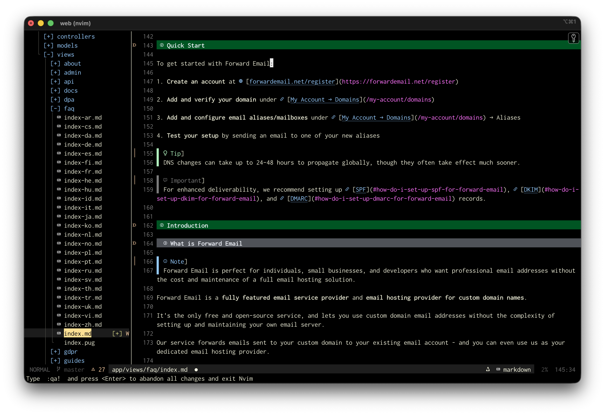

# Complete macOS Development Environment

**A comprehensive setup combining Neovim with AI capabilities and macOS system configuration**

This package provides everything you need for a modern, productive, and secure macOS development environment.



## 📦 What's Included

### 1. Neovim Configuration
- **AI-powered coding** with Avante + local Ollama
- **Full LSP support** for multiple languages
- **Modern plugins**: Telescope, Neo-tree, Treesitter, Git integration
- **Voice control** with Handy integration (optional)

### 2. macOS System Setup
- **Brewfile** with 90+ CLI tools and 40+ GUI applications (including ansible)
- **Security hardening**: FileVault, Firewall, telemetry blocking
- **Privacy enhancements**: Cloudflare DNS, tracking prevention
- **Shell setup**: zsh, Powerlevel10k, fzf with Ctrl+R
- **System tweaks**: Finder, Dock, keyboard shortcuts

## 🚀 Quick Start

### 1. Install System Packages

```bash
# Install Homebrew
/bin/bash -c "$(curl -fsSL https://raw.githubusercontent.com/Homebrew/install/HEAD/install.sh)"

# Install all packages from Brewfile
cd macos-setup
brew bundle --file=Brewfile
```

### 2. Install Neovim Configuration

```bash
# Backup existing config
mv ~/.config/nvim ~/.config/nvim.backup

# Copy new config
cp -r . ~/.config/nvim/
```

### 3. Start Ollama

```bash
ollama serve

# In another terminal
ollama pull qwen2.5-coder:7b-instruct-q4_K_M
```

### 4. Test

```bash
nvim
# Press ,aa to open Avante
# Ask coding questions, get refactoring help, generate code
```

## 📁 Documentation

### Neovim
- **[NEOVIM_README.md](NEOVIM_README.md)** - Complete Neovim documentation
- **[QUICKSTART.md](QUICKSTART.md)** - Fast Neovim setup
- **[KEYBINDINGS.md](KEYBINDINGS.md)** - All key bindings
- **[PLUGINS.md](PLUGINS.md)** - Plugin documentation

### macOS Setup
- **[macos-setup/README.md](macos-setup/README.md)** - Quick overview
- **[macos-setup/MACOS_SETUP_GUIDE.md](macos-setup/MACOS_SETUP_GUIDE.md)** - Complete guide

## 📚 Complete Documentation Index

### Installation & Setup
- [README.md](README.md) - This file
- [COMPLETE_INSTALLATION_GUIDE.md](COMPLETE_INSTALLATION_GUIDE.md) - Complete setup guide
- [verify-installation.sh](verify-installation.sh) - Installation checker

### Neovim Features
- [NEOVIM_README.md](NEOVIM_README.md) - Main Neovim docs
- [QUICKSTART.md](QUICKSTART.md) - 5-minute guide
- [KEYBINDINGS.md](KEYBINDINGS.md) - All key bindings
- [PLUGINS.md](PLUGINS.md) - Plugin documentation
- [LSP_DIAGNOSTICS.md](LSP_DIAGNOSTICS.md) - LSP guide

### AI & Automation
- [OLLAMA_SETUP.md](OLLAMA_SETUP.md) - Local AI setup
- [OLLAMA_MODELS.md](OLLAMA_MODELS.md) - Model documentation
- [VOICE_CONTROL_SIMPLE.md](VOICE_CONTROL_SIMPLE.md) - Voice control setup (optional)

### macOS Configuration
- [macos-setup/README.md](macos-setup/README.md) - Overview
- [macos-setup/MACOS_SETUP_GUIDE.md](macos-setup/MACOS_SETUP_GUIDE.md) - Complete guide
- [macos-setup/Brewfile](macos-setup/Brewfile) - All packages
- [macos-setup/setup-fzf.sh](macos-setup/setup-fzf.sh) - fzf installer

### Troubleshooting
- [TROUBLESHOOTING.md](TROUBLESHOOTING.md) - Common issues

### Terminal & Theme
- [NERD_FONTS.md](NERD_FONTS.md) - Font installation
- [TERMINAL_SETUP.md](TERMINAL_SETUP.md) - Terminal config
- [IR_BLACK_THEME.md](IR_BLACK_THEME.md) - Color scheme

### Development
- [LINTER_CONFIG_FILES.md](LINTER_CONFIG_FILES.md) - Linter configs
- [MIGRATION.md](MIGRATION.md) - Vim to Neovim migration
- [CONTRIBUTING.md](CONTRIBUTING.md) - Contribution guide

## ⌨️ Key Bindings Quick Reference

### Neovim (Leader: `,`)
- `,aa` - Open Avante (AI assistant)
- `,e` - Toggle file tree
- `,ff` - Find files
- `,fg` - Search in files
- `,gg` - Open LazyGit
- `gA` - Format code

### Shell (with fzf)
- **Ctrl+R** - Fuzzy search command history
- **Ctrl+T** - Fuzzy search files
- **Alt+C** - Fuzzy search directories

## 🔐 Security Features

- ✅ FileVault encryption enabled
- ✅ Firewall with blocked incoming connections
- ✅ Apple telemetry blocked
- ✅ Privacy-focused DNS (Cloudflare)
- ✅ Local AI (no cloud services)
- ✅ Gatekeeper kept enabled

## 🎯 Installation Checklist

### macOS System (30-60 min)
- [ ] Install Homebrew
- [ ] Run `brew bundle` from macos-setup/
- [ ] Run `./setup-fzf.sh`
- [ ] Configure Powerlevel10k (`p10k configure`)
- [ ] Enable FileVault
- [ ] Enable Firewall
- [ ] Block Apple telemetry
- [ ] Apply Finder/Dock tweaks

### Neovim (15-30 min)
- [ ] Copy config to `~/.config/nvim/`
- [ ] Run `./verify-installation.sh`
- [ ] Start Ollama: `ollama serve`
- [ ] Pull model: `ollama pull qwen2.5-coder:7b-instruct-q4_K_M`
- [ ] Test Neovim: `nvim`
- [ ] Test Avante: `,aa`

## 🔄 Maintenance

```bash
# Update Homebrew packages
brew update && brew upgrade && brew cleanup

# Update Neovim plugins
nvim
:Lazy update

# Update Ollama
brew upgrade ollama
ollama pull qwen2.5-coder:7b-instruct-q4_K_M
```

## 📖 Additional Resources

- [Neovim Documentation](https://neovim.io/doc/)
- [Avante.nvim](https://github.com/yetone/avante.nvim)
- [Ollama](https://ollama.ai/)
- [drduh/macOS-Security-and-Privacy-Guide](https://github.com/drduh/macOS-Security-and-Privacy-Guide)
- [fzf](https://github.com/junegunn/fzf)
- [Powerlevel10k](https://github.com/romkatv/powerlevel10k)

## 🤝 Contributing

Suggestions and improvements welcome! This is a living configuration.

## 📄 License

MIT License - See [LICENSE.md](LICENSE.md)

---

**Quick Links**:
- [Neovim Docs](NEOVIM_README.md)
- [macOS Setup](macos-setup/MACOS_SETUP_GUIDE.md)
- [Complete Installation Guide](COMPLETE_INSTALLATION_GUIDE.md)
- [Troubleshooting](TROUBLESHOOTING.md)
